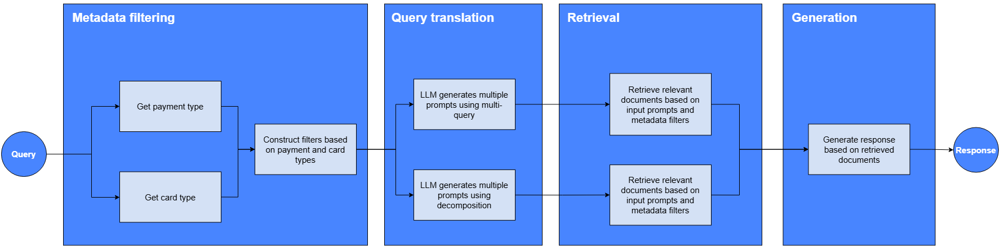

# RAG Pipeline Components



RAG pipeline consists of the following stages:
- Metadata filtering:
    - The llm is used to identify the payment type (credit/debit/any) and card type (visa_classic/visa_gold/visa_infinite/visa_platinum/visa_signature/any).
        - Uses openai's `with_structured_output` and pydantic model to coerce the output.
    - These metadata are then used as a filter during the retrieval stage.
- Query translation:
    - The idea of query translation is that user queries are not optimized for retrieval. Hence, we need to transform these user queries. 
    - The llm is used to generate multiple prompts, which are then used for retrieval.
    - The table below illustrates the usefulness of multi-query and decomposition query translation:

        Query translation type | Query | Response without query translation | Response with query translation |
        -----------------------|-------|------------------------------------|---------------------------------|
        Multi-query | any dining on water? |  `Unable to return any dining offers`* | `Returned dining offers e.g. royal albatross`* |
        Decomposition | i want to eat, shop and do fun activities. | `Only returned dining offers`* | `Returned offers for dining, shopping and fun activities`*|
        
        \* Included summary as quoting the response would be too lengthy.
- Retrieval:
    - Retrieves top k documents based on similarity to the query-translated prompts.
- Generation:
    - Generates response based on retrieved documents.

# Future Work
- Use a microservice architecture
    - Separate docker containers for frontend and backend
    - Host database separately (Consider leader replica for high avalability and scalability)
- Design considerations for scalability
    - Load balancer
    - Scaling docker containers by TTFT
- Implement queue for high availability
- Add logging and monitoring servers
- Additional functional requirements
    - e.g. rating responses
- Automatic update of vector database when VISA offers are updated
- Authentication to ensure only VISA card holders are using this service
- Explore further on agentic RAG


# Using this Repository

## Deploy on AWS
1. Build and push docker image to ECR
```
export AWS_ACCOUNT_ID=<AWS_ACCOUNT_ID>
export AWS_REGION=<AWS_REGION>

./build-and-push-image.sh
```

2. Terraform apply to spin up rag-demo app on EC2 instance.
```
cd terraform

export TF_VAR_LANGCHAIN_API_KEY=<LANGCHAIN_API_KEY>
export TF_VAR_KEY_NAME=<KEY_NAME>
export TF_VAR_OPENAI_API_KEY=<OPENAI_API_KEY>
export TF_VAR_AWS_ACCOUNT_ID=<AWS_ACCOUNT_ID>

terraform init
terraform apply --auto-approve
```

## Deploy locally
1. Create conda environment using `requirements.txt`, set the same environment variables as above, and then start streamlit as shown below:
```
cd rag-demo
streamlit run main.py
```